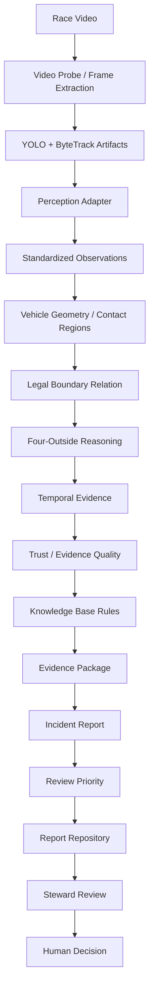

# KERB — Race Intelligence, Built for Stewards

KERB is a steward-assistance system for finding and reviewing potential track-limit incidents in race footage.

> **AI finds the incident. The steward makes the decision.**

KERB takes the searching out of stewarding, not the judgment. It combines vehicle detection/tracking artifacts, conservative geometry, legal-boundary reasoning, temporal evidence, deterministic trust scoring, a rule registry, evidence packaging, report history, and human review.

KERB does **not** issue penalties or act as an autonomous referee. Its AI-facing incident states are `NO_VIOLATION`, `VIOLATION_CANDIDATE`, and `UNCERTAIN`. Final sporting decisions are separate steward decisions: `TRACK_LIMIT_EXCEEDED` or `TRACK_LIMIT_NOT_EXCEEDED`.

**Authors:** Waqar Akhtar · Prithvi Kaushik  
**Built for:** TrackShift 2026 · Plaksha University

## Overview

The difficult part of track-limit review is not only detecting a car. A steward needs to know which vehicle was involved, where its approximate contact regions were relative to a legal boundary, whether the observation persists over time, how observable the evidence is, and why the system surfaced the event.

KERB treats track-limit detection as a spatio-temporal evidence problem:

```text
CV tells us what is in the frame.
Spatio-temporal reasoning tells us what happened.
```

The current repository contains:

- A FastAPI backend for video probing, frame extraction, analysis, incidents, reports, sessions, and a recorded A5 pipeline demo.
- A modular incident-intelligence layer for geometry, temporal evidence, trust, evidence packages, reports, and steward review.
- A Knowledge Base with deterministic rule definitions and dependencies.
- A Next.js frontend with a radial KERB navigation wheel and pages for overview, analysis, incidents, evidence, knowledge, system, reports, and How It Works.
- A real recorded-artifact demo path under `data/audit/` when those local artifacts are available.
- A deterministic development provider for demonstrating the complete API/frontend contract without claiming live YOLO inference.

## The Problem

Race footage contains many vehicles and a large number of frames. Important events may be brief, partially occluded, blurred, close to a boundary, or difficult to interpret from a single image.

The evidence problem combines:

- Vehicle identity across frames.
- Bounding-box or mask-derived vehicle geometry.
- Approximate contact regions.
- A manually configured legal boundary.
- Boundary relation and contact semantics.
- Temporal persistence.
- Evidence observability and uncertainty.
- A human-reviewable evidence package.

KERB is intentionally scoped as a steward-assist vertical slice rather than a general-purpose circuit-wide adjudication engine.

## How KERB Works



There are two important execution paths in the repository:

1. **Recorded A5 artifact path:** `backend/api/routes/demo.py` exposes existing A5 perception, surface, geometry, and incident artifacts under `/api/demo/*`. `RealA5AnalysisProvider` feeds the recorded artifacts through the downstream intelligence pipeline.
2. **Uploaded-session path:** `backend/api/routes/sessions.py` accepts a short upload, extracts keyframes, runs YOLO + ByteTrack as a background job, accepts manual boundary calibration, runs geometry and incident intelligence, and stores a session report.
3. **Development compatibility path:** `POST /api/analysis` uses `DevelopmentAnalysisProvider`, which creates deterministic development scenarios through the same downstream pipeline. This path is explicitly marked `DEVELOPMENT_MOCK` and does not claim real inference.

## Core Intelligence

### Vehicle Detection and Tracking

`backend/skills/perception/tracking.py` contains the current Ultralytics YOLO + ByteTrack implementation. It expects a model whose class `0` is `f1_car`, tracks on CPU, and emits `TrackRecord` records containing:

- `frame_index`
- `timestamp_seconds`
- `track_id`
- `x1`, `y1`, `x2`, `y2`
- `detector_confidence`

Persistent track IDs matter because later reasoning must operate on the same vehicle over time.

### Perception Contract

`backend/skills/incident_report/perception_adapter.py` defines the downstream contract through `StandardizedObservation`:

- A shared `Detection` model.
- Exactly four `ContactRegion` objects.
- A geometry method such as `BBOX_PROXY`.
- Optional context flags.
- Optional reliability metadata.

The adapter accepts `TrackRecord`-like objects or mappings, so the downstream pipeline does not depend on YOLO or ByteTrack implementation details.

Prithvi’s remaining integration requirement is to provide or pair detection records with final contact-region observations. The current perception tracker itself emits detections and boxes; contact-region output is consumed through the adapter and downstream geometry contract.

### Vehicle Geometry and Contact Regions

The geometry modules use conservative, approximate vehicle footprints and contact markers. They are not tire-center detectors. The documented geometry behavior includes:

- A fixed/manual boundary configuration.
- Approximate footprint classification from tracked boxes.
- Four contact-region names: `front_left`, `front_right`, `rear_left`, `rear_right`.
- `BBOX_PROXY` contact markers where richer geometry is unavailable.
- Explicit observability and reliability values.

The geometry README documents `INSIDE`, `BOUNDARY`, `OUTSIDE`, and `UNCERTAIN` spatial relations and keeps boundary tolerance configuration-specific.

### Four-Outside Rule

`backend/skills/incident_report/geometry/rules.py` implements the frame-level rule:

- All four contact regions `OUTSIDE` → `VIOLATION_CANDIDATE`.
- Any `INSIDE` region → `NO_VIOLATION`.
- Any `ON_BOUNDARY` region → `NO_VIOLATION`.
- Any critical `UNKNOWN` region → `UNCERTAIN`.

Important distinctions:

- `ON_BOUNDARY` is not `OUTSIDE`.
- `UNKNOWN` is not `OUTSIDE`.
- A vehicle center point or bounding-box center is not sufficient evidence.
- The four-outside condition is the sporting frame condition; temporal support is a separate reliability mechanism.

### Temporal Reasoning

`backend/skills/incident_report/temporal/` searches an event-centered, track-specific window. The current MVP uses a five-observation window and requires three supporting observations:

```text
84.12
84.22
84.32  ← event
84.42
84.52
```

`3 / 5` is a reliability filter. It is not the sporting track-limit rule and is not a probability.

The current temporal mode is `SINGLE_VIEW`; multi-camera fusion is not implemented.

### Trust and Evidence Quality

`TrustScorer` calculates a deterministic evidence-quality score, not a probability or sporting certainty.

Current scoring:

| Factor | Points |
| --- | ---: |
| Base score | 50 |
| Stable tracking | +15 |
| Clear boundary | +10 |
| Contact visibility | +10 |
| Geometric margin | +10 |
| Temporal support | +5 |
| Maximum | 100 |

Trust bands are:

- `HIGH`: 90–100
- `MEDIUM_HIGH`: 75–89
- `MEDIUM`: 60–74
- `LOW`: below 60
- `UNCERTAIN`: critical contact observability failure

If a critical contact region is unknown, the score is capped at `59` and the band becomes `UNCERTAIN`.

### Uncertainty Handling

Unknown evidence is first-class. Occlusion, blur, poor geometry, unstable tracking, poor boundary visibility, or extreme viewing angles must not be silently converted into an outside classification.

The system uses `UNKNOWN` contact states and `UNCERTAIN` incident states rather than forcing every observation into a binary result.

### Knowledge Base

`backend/knowledge/` contains the rule schema, registry, and enabled rule definitions. Each rule can include a category, priority, dependencies, evidence requirements, parameters, version, and enabled state.

The current registry contains:

| ID | Rule | Category |
| --- | --- | --- |
| `TL-001` | Four Outside Rule | `TRACK_LIMITS` |
| `TL-002` | Forced Off Track | `TRACK_LIMITS` |
| `BD-001` | Boundary Contact | `BOUNDARY` |
| `CT-001` | Vehicle Contact Regions | `CONTACT` |
| `TM-001` | Temporal Support | `TEMPORAL` |
| `UN-001` | Unknown Contact Handling | `UNCERTAINTY` |
| `EV-001` | Steward Review Required | `EVIDENCE` |

The Knowledge page currently consumes a typed frontend mirror because no dedicated Knowledge REST endpoint exists yet.

### Evidence Generation

`EvidencePackageBuilder` and `IncidentReportBuilder` create structured records containing, where available:

- Incident ID.
- Session and vehicle information.
- Event timestamp and frame.
- Contact-region states.
- Boundary tolerance and four-outside result.
- Temporal window and supporting frames.
- Trust score, band, and breakdown.
- Evidence frame metadata.
- Applied Knowledge Base rules.
- Context flags and reasons.
- Review state.

The purpose is simple:

> Find the moment. Explain the evidence. Leave the decision to the steward.

### Incident Prioritization

The current MVP repository orders reports by descending trust score. This is a review-priority ordering, not a probability ranking and not a claim that a higher score means a sporting violation is more likely.

### Forced-Off-Track Context

`TL-002` is contextual. It does not overwrite the AI state.

The intended relationship is valid and supported by the review model:

```text
AI assessment: VIOLATION_CANDIDATE
Context: POSSIBLE_FORCED_OFF_TRACK
Steward decision: TRACK_LIMIT_NOT_EXCEEDED
```

This is one of the clearest demonstrations that KERB assists stewarding rather than replacing it.

### Steward Review

The report repository preserves the original AI assessment and appends review information. The review payload accepts only:

- `TRACK_LIMIT_EXCEEDED`
- `TRACK_LIMIT_NOT_EXCEEDED`

The stored review can include:

- Decision.
- Reason.
- Notes.
- Reviewer.
- Review timestamp.

The current implementation directly persists `PENDING_REVIEW → REVIEWED`; the broader `GENERATED → PENDING_REVIEW → UNDER_REVIEW → REVIEWED` lifecycle is a future refinement, not a completed state machine.

## Backend

Important backend areas:

```text
backend/
├── api/
│   ├── main.py
│   ├── routes/
│   │   ├── analysis.py       # Development compatibility analysis API
│   │   ├── demo.py           # Recorded A5 artifact demo
│   │   ├── incidents.py
│   │   ├── reports.py
│   │   └── sessions.py       # Uploaded-session workflow
│   ├── providers/
│   │   ├── development.py
│   │   ├── real.py
│   │   └── session.py
│   └── schemas/
├── knowledge/
├── reports/
├── skills/
│   ├── perception/
│   ├── geometry/
│   ├── surface/
│   ├── video/frame_extraction/
│   └── incident_report/
└── ...
```

The uploaded-session workflow is more complete than the compatibility `/api/analysis` endpoint: it saves an upload, extracts keyframes, runs background YOLO + ByteTrack, accepts manual boundary calibration, runs geometry, then produces incident intelligence and a stored report.

## Frontend

The frontend is a Next.js App Router application using React, TypeScript, Tailwind CSS v4, Framer Motion, and Lucide icons.

Primary routes:

| Route | Purpose |
| --- | --- |
| `/` | Cinematic KERB overview/landing surface with live intelligence overlay |
| `/analysis` | Upload/probe/extract/analyze workstation |
| `/incidents` | Backend-backed prioritized incident queue |
| `/incidents/[incidentId]` | Incident evidence workstation |
| `/evidence` | Evidence gallery plus live evidence summary |
| `/knowledge` | Rule deck, inspector, and dependency graph |
| `/system` | Pipeline architecture and backend health state |
| `/reports` | Historical report archive and steward review workspace |
| `/how-it-works` | Editorial explanation of KERB’s reasoning pipeline |

The shared radial Nav Wheel is the primary navigation system. The visual language is dark graphite/black, off-white, restrained red, technical labels, thin borders, and controlled motion.

## API

### Core API routes

| Method | Endpoint | Purpose |
| --- | --- | --- |
| `GET` | `/api/health` | Backend and FFmpeg availability |
| `POST` | `/api/video/probe` | Probe uploaded video metadata and frame count |
| `POST` | `/api/video/extract-frames` | Extract PNG frames and return frame URLs |
| `POST` | `/api/analysis` | Run deterministic development analysis provider |
| `GET` | `/api/incidents` | List incidents with optional state/session/track/review filters |
| `GET` | `/api/incidents/{incident_id}` | Retrieve incident evidence package |
| `GET` | `/api/reports` | List stored report summaries |
| `GET` | `/api/reports/{report_id}` | Retrieve full report/evidence detail |
| `POST` | `/api/reports/{report_id}/review` | Append a steward review |

### Uploaded sessions

The newer uploaded-session workflow is exposed under `/api/sessions`:

| Method | Endpoint | Purpose |
| --- | --- | --- |
| `POST` | `/api/sessions` | Save upload, probe it, and prepare keyframes |
| `GET` | `/api/sessions` | List uploaded sessions |
| `GET` | `/api/sessions/{session_id}` | Retrieve session state and artifacts |
| `POST` | `/api/sessions/{session_id}/track` | Start background YOLO + ByteTrack |
| `GET` | `/api/sessions/{session_id}/job` | Read tracking job state |
| `POST` | `/api/sessions/{session_id}/boundary` | Save manual boundary calibration |
| `POST` | `/api/sessions/{session_id}/run` | Run geometry and incident intelligence |
| `GET` | `/api/sessions/{session_id}/incident` | Retrieve session incident |

Session uploads are capped at 30 seconds by the current backend code. The session workflow requires manual boundary calibration before analysis.

### Recorded A5 demo routes

`/api/demo/*` exposes real local A5 artifacts when the expected ignored data artifacts exist, including:

- `/api/demo/state`
- `/api/demo/run`
- `/api/demo/incident`
- `/api/demo/tracks`
- `/api/demo/spatial`
- `/api/demo/geometry`
- `/api/demo/perception/video`
- `/api/demo/surface/video`
- `/api/demo/frames/{name}`

The demo route is artifact-backed and is separate from the deterministic development provider.

## Project Structure

```text
.
├── backend/
│   ├── api/
│   ├── knowledge/
│   ├── reports/
│   └── skills/
├── frontend/
│   ├── public/
│   └── src/
├── Documents/
├── data/                 # ignored video/generated/audit artifacts
├── models/               # ignored model checkpoints when present
├── pyproject.toml
├── uv.lock
└── README.md
```

## Getting Started

The repository uses Python 3.14 and `uv` for backend dependency management. The frontend uses Node/npm and has a committed `package-lock.json`.

### Backend setup

From the repository root:

```bash
uv sync
```

The project is configured to use CPU PyTorch wheels through the explicit PyTorch CPU index. A model checkpoint is not currently committed under `models/`.

### Frontend setup

```bash
cd frontend
npm install
```

The frontend API client defaults to `http://127.0.0.1:8000`. To override it, set:

```text
NEXT_PUBLIC_API_BASE_URL=http://127.0.0.1:8000
```

Environment files are ignored by the frontend repository configuration.

## Running KERB

Start the backend from the repository root:

```bash
uv run python -m uvicorn backend.api.main:app --reload --port 8000
```

Backend health:

```text
http://127.0.0.1:8000/api/health
```

Swagger/OpenAPI:

```text
http://127.0.0.1:8000/docs
```

Start the frontend in a second terminal:

```bash
cd frontend
npm run dev
```

Frontend:

```text
http://localhost:3000
```

The backend permits browser requests from `http://localhost:3000` and `http://127.0.0.1:3000` during local development.

## Example API Usage

Probe a video:

```bash
curl -F "file=@path/to/race.mp4" http://127.0.0.1:8000/api/video/probe
```

Extract frames:

```bash
curl \
  -F "file=@path/to/race.mp4" \
  -F "fps=1" \
  -F "preset=balanced" \
  http://127.0.0.1:8000/api/video/extract-frames
```

The extraction response includes `source_frames`, `frames_extracted`, and browser-servable `frame_urls`.

Run the compatibility analysis endpoint:

```bash
curl -F "file=@path/to/race.mp4" http://127.0.0.1:8000/api/analysis
```

Submit a steward review:

```bash
curl \
  -X POST \
  -H "Content-Type: application/json" \
  -d '{
    "decision": "TRACK_LIMIT_NOT_EXCEEDED",
    "reason": "FORCED_OFF_TRACK",
    "notes": "Vehicle was forced beyond the boundary.",
    "reviewer": "steward"
  }' \
  http://127.0.0.1:8000/api/reports/KERB-0001/review
```

## Current Implementation Status

| Component | Status |
| --- | --- |
| Video probing | Implemented |
| Frame extraction | Implemented |
| YOLO + ByteTrack tracker | Implemented in `backend/skills/perception/tracking.py`; model checkpoint is external/ignored |
| Perception adapter | Implemented |
| Vehicle geometry | Implemented; conservative configured geometry stage |
| Contact-region reasoning | Implemented through standardized observations and box-proxy/geometry bridges |
| Manual boundary calibration | Implemented for uploaded sessions/A5 demo artifacts |
| Four-outside reasoning | Implemented |
| Temporal validation | Implemented; current pipeline uses a five-observation search with three-support threshold |
| Trust scoring | Implemented deterministic heuristic |
| Knowledge Base | Implemented in backend; frontend uses a typed mirror because no Knowledge API route exists |
| Evidence generation | Implemented as structured package/report metadata; image serving varies by path |
| Incident API | Implemented |
| Report repository | Implemented in-memory repository |
| Steward review | Implemented as appended review data; current API writes `REVIEWED` directly |
| Uploaded session workflow | Implemented under `/api/sessions`; requires model and manual boundary |
| Recorded A5 demo | Implemented under `/api/demo` when local audit artifacts exist |
| Frontend | Implemented Next.js product shell and API-backed analysis/incidents/reports flows |
| Real `/api/analysis` perception | Not connected to YOLO output; uses `DEVELOPMENT_MOCK` provider |

## Real, Mock, and Pending Boundaries

### Real or repository-backed

- FastAPI route layer.
- FFmpeg/ffprobe video probing and extraction.
- YOLO + ByteTrack implementation in the perception skill.
- Geometry and manual-boundary modules.
- Surface classifier/manual-boundary artifacts where configured.
- Incident intelligence domain modules.
- Knowledge Base registry.
- In-memory report repository.
- Steward-review API contract.
- Recorded A5 artifact demo when ignored artifacts are present.
- Frontend route and API-client wiring.

### Development/mock

- `POST /api/analysis` currently calls `DevelopmentAnalysisProvider`, which creates deterministic cases for the frontend/API contract.
- It intentionally emits legal, candidate, boundary-touch, uncertain, and forced-off-track development scenarios.
- The frontend Knowledge page uses a local typed mirror because there is no backend Knowledge endpoint.
- Some frontend How It Works media is supplied manually under `frontend/public/how-it-works-assets/`.

### Waiting for final perception integration

The downstream adapter expects a standardized observation containing:

- `frame_index`
- `timestamp_s`
- `track_id`
- `bbox`
- detector confidence
- four `ContactRegion` values
- geometry method
- observability/reliability metadata

The current `TrackRecord` emitted by `backend/skills/perception/tracking.py` contains detection/tracking fields and a bounding box. The remaining integration work is to connect final perception/contact-region output to `StandardizedObservation`; the downstream pipeline is already structured to consume it.

## Human-in-the-Loop Safety

KERB is not an autonomous referee.

AI outputs are limited to:

- `NO_VIOLATION`
- `VIOLATION_CANDIDATE`
- `UNCERTAIN`

The system never exposes an AI state as `GUILTY`, `PENALTY`, or `CONFIRMED_VIOLATION`. A candidate remains review-required, and a steward decision is stored separately from the original AI assessment.

The central safety property is:

```text
AI assessment ≠ steward decision
```

## Example Incident

A structured candidate can contain:

```json
{
  "incident_id": "INC-0001",
  "event": {
    "timestamp_s": 84.32,
    "frame_index": 4216
  },
  "vehicle": {
    "track_id": 16
  },
  "ai_assessment": {
    "state": "VIOLATION_CANDIDATE",
    "trust_score": 100
  },
  "temporal": {
    "eligible_frames": 5,
    "supporting_frames": 5,
    "temporal_support": true
  },
  "review": {
    "status": "PENDING_REVIEW",
    "decision": null
  }
}
```

The candidate is surfaced for steward review. It does not automatically assign a penalty.

## Demo Flow

The current judge-facing flow is:

1. Open the KERB frontend.
2. Open **Analysis** and select a clip.
3. Probe the video and show its frame count.
4. Extract frames and inspect the horizontal frame carousel.
5. Run the available analysis provider.
6. Open **Incidents** and select a prioritized candidate.
7. Inspect vehicle identity, timestamp, frame, contact regions, boundary, temporal evidence, trust, reasons, and applied rules.
8. Confirm `STEWARD REVIEW REQUIRED`.
9. Open **Reports** and select the pending historical record.
10. Choose `TRACK_LIMIT_EXCEEDED` or `TRACK_LIMIT_NOT_EXCEEDED`.
11. Add a reason and notes, then save the review.
12. Confirm the report becomes `REVIEWED` while the original AI assessment remains unchanged.
13. Open **Knowledge** to inspect the rules behind the reasoning.
14. Open **System** to explain the architecture and backend health.
15. Use the frontend-only `FORWARDED TO STEWARDS' BOT` acknowledgement if needed.

For the stronger real-artifact demonstration, use `/api/demo/state` and the `/api/sessions` workflow when the required A5 artifacts/model are available.

## Real-Time and Scalability

The repository measures tracking metrics for the perception artifact path, but this README intentionally does not claim a universal real-time rate or production latency. The project scope explicitly excludes guaranteed broadcast real-time performance.

Potential future deployment optimizations include:

- Frame sampling.
- Batching.
- CPU/GPU-specific inference tuning.
- Lightweight tracking between detector passes.
- Bounded temporal buffers.
- Event-triggered evidence generation.

These are architecture options, not benchmarked claims in this repository.

## Limitations

- The MVP targets a fixed/manual camera boundary and one track-limit zone.
- Contact regions are approximate markers, not guaranteed tire centers.
- Occlusion, blur, poor observability, and extreme viewing angles can yield `UNCERTAIN`.
- The main `/api/analysis` endpoint is still a deterministic development provider rather than the final YOLO-connected path.
- The uploaded-session workflow requires an external model checkpoint and a manually calibrated boundary.
- The A5 demo depends on ignored local artifacts under `data/audit/`.
- The report repository is in-memory and resets when the process restarts.
- The Knowledge frontend has no dedicated backend Knowledge API yet.
- Evidence image availability depends on the active demo/session path.
- Multi-camera fusion, 3D reconstruction, automatic calibration, telemetry integration, and calibrated probabilities are out of scope.
- No autonomous sporting adjudication or penalty issuance exists.

## Future Work

Future extensions, not current claims, include:

- Connect Prithvi’s final perception/contact-region output to the standardized adapter.
- Improve vehicle/contact geometry while retaining conservative uncertainty behavior.
- Add a typed Knowledge Base API endpoint.
- Add persistent report storage beyond the in-memory repository.
- Add richer evidence image/frame APIs.
- Expand multi-camera and circuit/session support.
- Integrate telemetry where available.
- Evaluate and benchmark the complete pipeline by clip/event with hardware recorded.
- Improve deployment throughput without claiming guaranteed real-time operation.

## Development Notes

- Video, generated frames, model weights, session artifacts, and generated audit media are ignored by Git according to the repository ignore rules.
- Do not commit supplied footage or generated media.
- Model checkpoints are expected outside the committed source tree.
- The frontend asset folder `frontend/public/how-it-works-assets/` contains manually supplied explanatory media and a README describing expected filenames.
- The backend uses relative repository paths for local session and artifact storage.

## Technology Stack

Backend:

- Python 3.14.
- FastAPI.
- Uvicorn.
- FFmpeg/ffprobe.
- OpenCV through the perception/surface tooling.
- Ultralytics YOLO.
- ByteTrack through the Ultralytics tracking API.
- CPU PyTorch wheels configured through `pyproject.toml`/`uv.lock`.

Frontend:

- Next.js `16.3.4`.
- React `19.2.8`.
- TypeScript.
- Tailwind CSS v4 via `@tailwindcss/postcss`.
- Framer Motion.
- Lucide React.

## Attribution and License

No project license file was found during the repository audit. Do not assume an open-source license for the KERB repository.

The repository contains project-specific video, geometry, surface, incident, and frontend implementations. No separate `video-frames-skill` attribution was verified in the current tree, so no third-party attribution claim is made here.

## Authors

- Waqar Akhtar
- Prithvi Kaushik

## Built For

TrackShift 2026  
Plaksha University

## Project Presentation

[Project Presentation](https://docs.google.com/presentation/d/1l4M-MBEN2DJWbMaHdadljdoO2UvTRzX3zXvt7MDVO8w/edit?usp=sharing)
